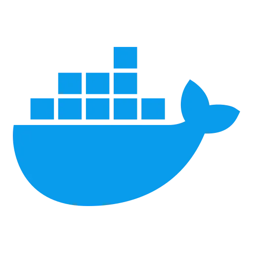
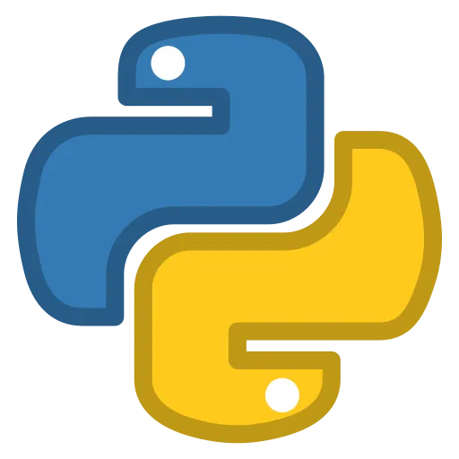
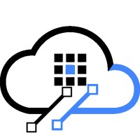
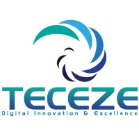

<%
    meta("../meta.json")
    meta()
    url = url + "/about/"
%>
<%= render("../_partials/header.html", { title, description, url }) %>

<nav class="about-toc" id="about-toc">

On this page

<ul class="about-toc__list">
<li><a href="#who-i-am" class="about-toc__link">Who I am</a></li>
<li><a href="#ai--agentic-security" class="about-toc__link">AI & Agentic Security</a>
<ul>
<li><a href="#ai-supply-chain-security" class="about-toc__link">AI supply chain</a></li>
<li><a href="#ai-threat-modelling" class="about-toc__link">AI threat modelling</a></li>
</ul>
</li>
<li><a href="#distributed-systems--microservice-security" class="about-toc__link">Distributed Systems</a></li>
<li><a href="#application-security--secure-sdlc" class="about-toc__link">Application Security</a></li>
<li><a href="#cloud-devops--infrastructure-security" class="about-toc__link">Cloud & Infrastructure</a>
<ul>
<li><a href="#kubernetes--container-security" class="about-toc__link">Kubernetes & Containers</a></li>
</ul>
</li>
<li><a href="#technical-areas" class="about-toc__link">Technical Areas</a></li>
<li><a href="#what-i-offer" class="about-toc__link">What I Offer</a></li>
<li><a href="#worked-with" class="about-toc__link">Worked With</a></li>
<li><a href="#get-in-touch" class="about-toc__link">Get in Touch</a></li>
</ul>
</nav>

<article class="about-article">

<h1 id="who-i-am">Who I am</h1>

I'm **Araharan Loganayagam**, a cybersecurity practitioner, researcher, and builder focused on offensive security, application security, cloud-native infrastructure, AI security, and distributed systems.

My work sits at the intersection of security engineering, adversary emulation, secure software delivery, DevSecOps, and modern AI systems. Over the years I've worked across application security, cloud environments, detection engineering, infrastructure hardening, microservice and distributed system security, and the rapidly expanding attack surface introduced by autonomous and agentic AI systems.

I hold an **MSc in Cyber Security (Distinction)** from the University of West London and a **BSc (Hons) in Information Technology** from the University of Moratuwa. I work hands-on with **Java, Python, Go, and TypeScript**, and regularly build and review systems using **LangChain, LangGraph, MCP server architectures**, agentic AI orchestration frameworks, and distributed service meshes.

Outside of professional work, I spend time on Hack The Box labs, CTF challenges, research projects, and mentoring people entering cybersecurity. I'm currently pursuing advanced offensive security and AI red-team focused certifications including the **OSCP**.

---

THIS BLOG COVERS

AI & LLM security research

Agentic AI attack surfaces

Offensive security and adversary simulation

Distributed systems and microservice security

Application security and secure SDLC

Cloud and Kubernetes security

Linux hardening and infrastructure defence

Threat detection and incident response

DevSecOps engineering and automation

Reconnaissance methodologies and tooling

Security architecture and real-world attack paths

API gateway and service mesh security

---

<h2 id="ai--agentic-security">AI & Agentic Security</h2>

Securing intelligent systems from prompt to production.

Modern AI systems are no longer isolated models responding to prompts. Today's agentic systems browse the web, call external tools, execute code, access APIs, retrieve documents from vector stores, and make chained decisions: often without a human in the loop. That introduces an entirely new security landscape, one where traditional perimeter and application security models are fundamentally insufficient.

My research spans LLM internals: how transformers process tokens, how foundational models differ from fine-tuned variants, and how retrieval-augmented generation (RAG) pipelines introduce retrieval-layer attack surfaces. This extends through to full agentic pipeline exploitation and red-teaming at scale.

---

OWASP TOP 10 FOR LLMS — AREAS I RESEARCH AND TEST

Prompt injection

Direct & indirect injection, system vs user prompt exploitation, cross-context leakage, tool-call manipulation

Insecure output handling

Output injection, downstream system abuse, XSS and code execution via LLM responses

Training data poisoning

Dataset manipulation, backdoor injection during fine-tuning, adversarial knowledge corruption

Model denial of service

Context window exhaustion, resource amplification attacks, sponge examples

Supply chain vulnerabilities

Compromised model artefacts, unsafe pickle files, poisoned datasets and third-party integrations

Sensitive information disclosure

Training data memorisation, inference-time leakage, covert exfiltration through model outputs

Insecure plugin design

Plugin and connected software attack scenarios, tool-call isolation failures, MCP server security

Excessive agency

Excessive permissions, autonomous action abuse, privilege escalation in agentic pipelines

Overreliance & hallucinations

Model hallucination risks, decision system overreliance, trust boundary abuse

Model theft

Model extraction via inference, stealing fine-tuned behaviour, IP and capability theft

---

MITRE ATLAS — TACTICS I MAP AND TEST AGAINST

Reconnaissance
Resource development
Initial access
ML model access
Execution
Persistence
Privilege escalation
Defense evasion
Credential access
Discovery
Collection
ML attack staging
Exfiltration
Impact

---

ADDITIONAL FOCUS AREAS

RAG & retrieval attacks

Knowledge-base poisoning, adversarial document injection, retrieval manipulation

Multi-agent trust boundaries

Orchestrator manipulation, hierarchy abuse, inter-agent trust collapse

AI DevOps pipeline attacks

Model creation and deployment pipeline attacks, CI/CD compromise in AI workflows

Emerging AI threats

Self-propagating model worms, AI-assisted firmware attacks, models without provenance

AI firewalls & guardrails

LLM Guard, prompt sanitisation, input/output filtering, behavioural auditing pipelines

Backdoor attacks

Backdoors in fine-tuning, trojanised neural networks, BackdoorBox-style attack chains

---

<h3 id="ai-supply-chain-security">AI supply chain security</h3>

Tracking provenance from training data to deployed model.

The AI supply chain is one of the most underexplored attack surfaces in enterprise security. Compromises don't always require touching a running model: attackers target datasets, pre-trained weights, dependency packages, and model-serving infrastructure. I work on vetting, hardening, and attesting every stage of the AI delivery lifecycle.

Data, model & infra attacks

Dataset poisoning, compromised weights, infrastructure-layer supply chain compromise

Package masquerading

Abusing generative AI for dependency confusion, typosquatting, hallucinated package exploitation

SBOM & MLBOM

Software and ML Bill of Materials generation, provenance attestations, model cards

Model signing & integrity

Signing and verifying ML models using Cosign, SLSA frameworks, SCVS compliance

Dependency vetting

Automated SCA for AI projects, dependency pinning, confusion attack mitigation

Trojanised model research

Creating and detecting trojanised neural networks, malicious pickle injection, ROME technique abuse

Frameworks I work with include SLSA, SCVS, NIST RMF, ISO/IEC 42001, the EU AI Act, and emerging US AI legislation. Tools include Syft, Grype, Picklescan, Cosign, and Snyk.

---

<h3 id="ai-threat-modelling">AI threat modelling</h3>

Structured thinking about AI system attack surfaces.

Threat modelling AI systems requires thinking beyond traditional STRIDE applications. LLM architectures introduce unique asset types: training data, model weights, embedding stores, and tool registries. The adversary goals don't map cleanly to conventional threat libraries. I apply structured threat modelling using data flow diagrams tuned for LLM architectures, then map findings across multiple AI-specific threat frameworks.

STRIDE — Applied to LLM DFDs
OWASP LLM Top 10 — Vulnerability mapping
MITRE ATLAS — Tactic-level mapping
BIML Risk Framework — ML-specific risks
AI Risk Repository — Emerging risk catalogue
AI Incident Database — Real-world case grounding

---

<h2 id="distributed-systems--microservice-security">Distributed Systems & Microservice Security</h2>

Securing the communication fabric between services.

Modern software architectures have moved decisively toward distributed systems: microservices, event-driven platforms, API gateways, service meshes, and asynchronous message queues. These architectures introduce powerful scalability properties and fundamentally different security challenges from monolithic systems. In a monolith, a single authentication check at the boundary may be sufficient. In a distributed system, every service-to-service call is a potential trust boundary that can be exploited.

Lateral movement, confused deputy attacks, internal SSRF chaining, and service impersonation are real and underappreciated risks in microservice environments. They sit adjacent to cloud-native threats in ways that require security thinking across both layers simultaneously.

Service-to-service auth

mTLS, SPIFFE/SPIRE, workload identity, JWT validation at the mesh layer

API gateway security

Rate limiting, schema validation, auth delegation, OWASP API Top 10, gateway bypass

Service mesh hardening

Istio, Linkerd, Envoy, Consul Connect — policy enforcement, traffic interception, egress control

Event-driven security

Kafka ACLs, message queue poisoning, schema registry integrity, event replay attacks

Lateral movement paths

Over-privileged service accounts, confused deputy, internal SSRF chaining across services

gRPC & async protocols

Proto schema enforcement, streaming attack surfaces, bi-directional stream security

Secrets in distributed envs

Vault dynamic secrets, sidecar injection, secret sprawl across service manifests

Zero-trust architecture

Identity-first networking, microsegmentation, continuous verification in service graphs

REST API security

OWASP API Top 10, SAST/DAST of APIs, SCA for API dependencies, auth review

---

<h2 id="application-security--secure-sdlc">Application Security & Secure SDLC</h2>

Building security into the development lifecycle, not bolting it on after.

I believe security should exist throughout the entire software development lifecycle, not only at the perimeter. My application security work focuses on building practical, scalable security programmes that engineering teams can realistically adopt without slowing delivery.

Secure SDLC programme design

CI/CD security automation and shift-left

SAST, DAST, SCA, secrets scanning, IaC scanning

Secure code review — Java, Python, Go, TypeScript

OAuth2 / OIDC and API security reviews

Threat modelling and secure design assessments

Dependency risk management and SBOM pipelines

Vulnerability lifecycle management and remediation SLAs

---

<h2 id="cloud-devops--infrastructure-security">Cloud, DevOps & infrastructure security</h2>

Security that moves at deployment speed.

Cloud-native environments require security that moves at deployment speed. My work spans AWS, Azure, GCP, Kubernetes, Terraform, CI/CD systems, secrets management, GitOps security, and container security engineering across the full cloud-native stack.

AWS IAM hardening and least-privilege architecture

EKS and Kubernetes RBAC / network policy security

Azure Sentinel and Defender engineering

GCP posture management and Binary Authorization

Infrastructure-as-Code security reviews (Terraform, Helm)

GitOps and deployment pipeline hardening

Container and image security

Secrets management and credential lifecycle control

Observability and security telemetry engineering

Tools include Trivy, Falco, Aqua, Prowler, ScoutSuite, Cosign, Notary, admission controllers, GitHub Actions, GitLab CI, Jenkins, and HashiCorp Vault.

---

<h3 id="kubernetes--container-security">Kubernetes & container security</h3>

Securing the 4C model: Cloud, Cluster, Container, Code.

Container and Kubernetes security is a discipline that spans low-level Linux primitives: namespaces, cgroups, and capabilities, all the way to cluster-wide admission control, RBAC misconfigurations, and supply chain attacks via malicious Helm charts. I work across the full 4C stack of cloud-native security: Cloud, Cluster, Container, and Code.

Container fundamentals & attacks

Namespaces, cgroups, capabilities, privilege escalation, container breakout techniques

Secure image engineering

Distroless images, Dockerfile hardening, Trivy scanning, Seccomp profiles, image signing

Kubernetes hacking

Kubelet API exploitation, privileged container abuse, secret extraction, dashboard attacks, kube-hunter

Kubernetes auth & RBAC

Client cert auth, bearer tokens, RBAC misconfiguration with KubiScan, Krane static analysis

Admission controllers

OPA Gatekeeper, Kube-mgmt, Pod Security Admission, LimitRanger, custom webhook policies

Kubernetes data security

Secrets at rest encryption, HashiCorp Vault injection, Sealed Secrets, Mozilla SOPS, KMS integration

Network security

Network policies, Calico, Istio mTLS, Linkerd, Consul Connect zero-trust networking

Runtime & compliance

Falco threat detection, gVisor sandboxing, Wazuh SIEM, CIS benchmarks, Kubebench

Supply chain in k8s

Poisoned image attacks, malicious Helm chart supply chain, Binary Authorization, Cosign

---

<h2 id="technical-areas">Technical areas</h2>

AI & LLM security

LLM red-teaming, prompt injection, agentic pipelines, MCP server security, RAG security, AI supply chain, behavioural auditing, OWASP LLM Top 10, MITRE ATLAS, BIML

Distributed systems security

Microservice security, service mesh hardening, mTLS, API gateway, event-driven security, zero-trust, SPIFFE/SPIRE, gRPC security

Container & Kubernetes

Container breakout, Kubernetes hacking, RBAC, OPA Gatekeeper, Falco, Trivy, CIS benchmarks, runtime security, network policies

Application security

Secure SDLC, SAST, DAST, SCA/SBOM, secure code review, API security, OAuth/OIDC, dependency governance

Offensive security

Reconnaissance, web exploitation, cloud assessments, adversary emulation, attack path analysis, privilege escalation, red-team tooling

Cloud & DevSecOps

AWS, Azure, GCP, Kubernetes, Terraform, CI/CD security, GitOps, secrets management, infrastructure hardening

Threat detection & IR

SIEM engineering, threat hunting, Sigma/YARA, ATT&CK mapping, malware triage, forensic analysis, timeline reconstruction, Kubernetes audit logs

Programming & automation

Java, Python, Go, TypeScript, Bash, PowerShell, automation tooling, detection engineering, secure engineering utilities

AI governance & compliance

NIST RMF, ISO/IEC 42001, SLSA, SCVS, EU AI Act, US AI legislation, model provenance and attestation

</article>

  

    
    
    
    
    
    
    
    
    
    
    
    
    
    
    
    
    
    
  

<article class="about-article">

---

<h2 id="what-i-offer">What I offer</h2>

Every engagement is scoped collaboratively based on business risk, engineering maturity, and operational realities.

AI / LLM security assessments and red-teaming

Agentic AI threat modelling

AI supply chain security and MLBOM programmes

Distributed system and microservice security reviews

Kubernetes and container security

Application security programme development

DevSecOps transformations

API and microservice security

Cloud security reviews and remediation

Penetration testing and adversary emulation

Threat detection engineering and incident response

Security workshops, mentoring, and training

---

<h2 id="worked-with">Worked With</h2>

</article>

  

    
    
    
    
    
    
    
    
  

<article class="about-article">

---

<h2 id="get-in-touch">Get in Touch</h2>

Reach me on [LinkedIn](https://www.linkedin.com/in/dream4ip/) or [Twitter/X](https://twitter.com/haran_loga). I'm open to consulting engagements, conference talks, and collaborative research, particularly anything at the boundary of AI systems, distributed infrastructure, and offensive security.

</article>

<%= render("../_partials/footer.html") %>
