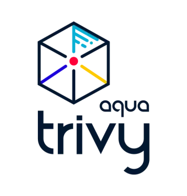
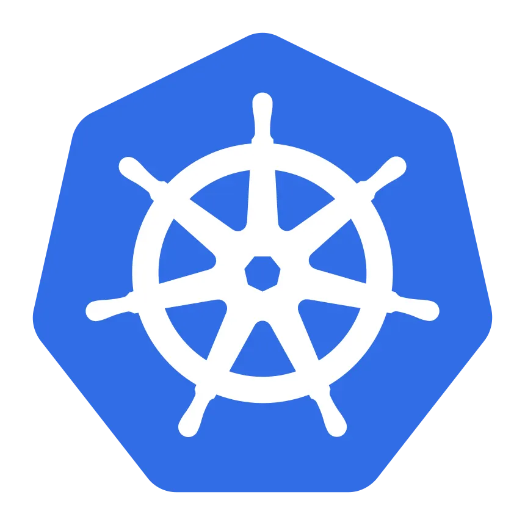
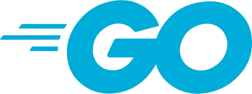
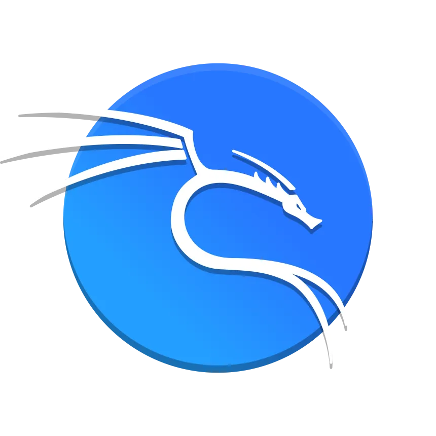
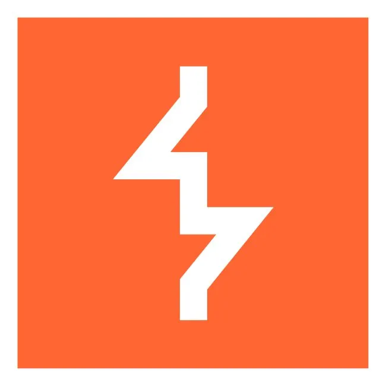
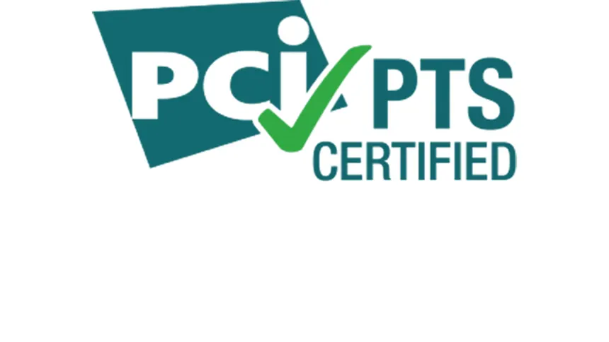
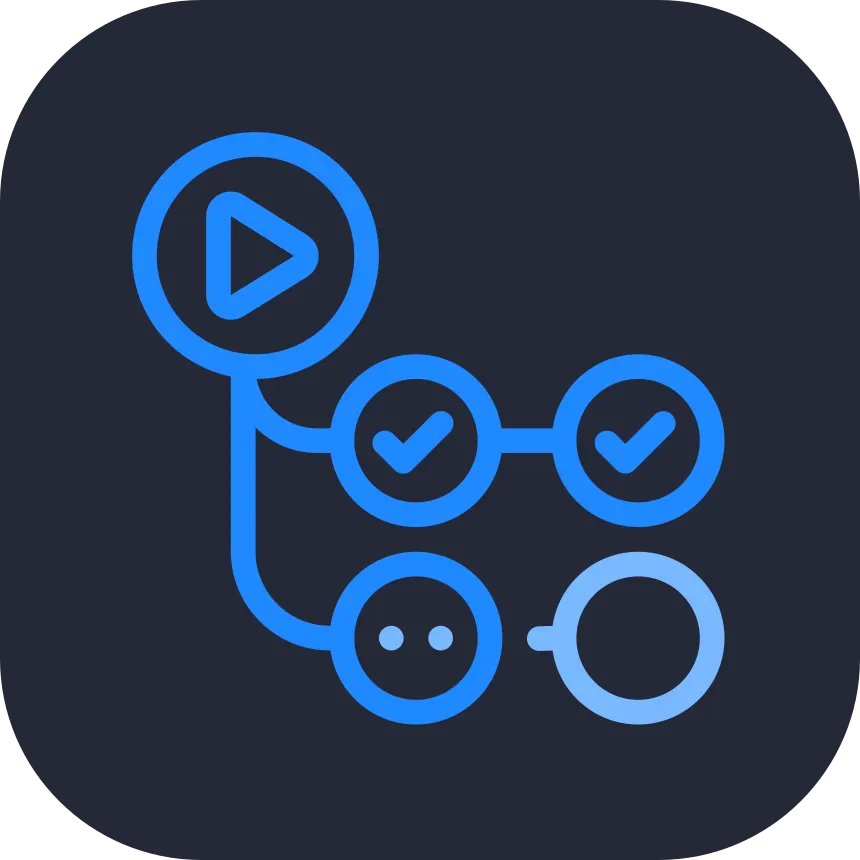
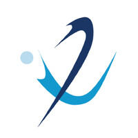
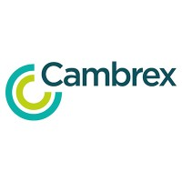

<%
	meta("../../meta.json")
	meta()
	const path = require('path');
	url = url + "/posts/" + path.basename(path.dirname(outputPath)) + "/";
%>
<%= render("../../_partials/post-header.html", { title, image, url, description, caption, date }) %>

<h1 class="toc-header">Table of contents</h1>

%%toc%%

# Who I am

I'm Araharan Loganayagam - realspaceeagle - a cybersecurity professional focused on penetration testing, cloud security, and DevSecOps. I spend most of my time reverse-engineering attack paths, automating blue-team playbooks, and turning those lessons into long-form write-ups so other practitioners can learn alongside me.

My toolkit spans offensive testing, threat emulation, infrastructure automation, and compliance frameworks such as NIST CSF, CIS Controls, ISO 27001, SOC 2, and PCI DSS. I enjoy building detection pipelines that mix ML, scripting, and cloud-native services to shorten response cycles and keep production estates resilient.

I hold an MSc in Cyber Security (Distinction) from the University of West London and a BSc (Hons) in Information Technology from the University of Moratuwa. Research projects have ranged from blockchain-backed malware detection engines to NLP-driven learning assistants and agriculture-focused social platforms.

Outside paid work I'm a regular on Hack The Box, CTF events, and local community initiatives, mentoring aspiring analysts while I pursue certifications such as OSCP and Practical Ethical Hacking. Expect this space to feature reconnaissance guides, Linux hardening notes, DevSecOps patterns, and incident-response walkthroughs inspired by the problems I encounter in the field.

## Technical expertise

- **Cloud & DevSecOps:** AWS IAM hardening, GuardDuty, Security Hub, Config, CloudTrail analytics; Azure Sentinel playbooks, Defender for Cloud, Key Vault, Purview; GCP SCC, IAM, Cloud Armor, Binary Authorization; Kubernetes RBAC/network policies with Terraform, GitLab CI, Jenkins security gates.
- **Threat detection & response:** SIEM engineering (Splunk, Sentinel, Elastic), threat hunting with MITRE ATT&CK plus Sigma/YARA development, incident response for forensics, malware triage, timeline reconstruction.
- **Offensive toolkit:** Recon (Nmap, Amass, Subfinder, theHarvester, Shodan, Censys), web testing (Burp Suite, OWASP ZAP, SQLMap, Gobuster), exploitation (Metasploit, Cobalt Strike, BloodHound), cloud/container assessments (Prowler, ScoutSuite, Trivy, Falco, Aqua).
- **Programming & automation:** Python for security automation/ML detection, Go for high-performance scanners, Bash for hardening/log triage, PowerShell for AD and Windows defense.
- **Frameworks & standards:** MITRE ATT&CK, OWASP Testing Guide, PTES, NIST CSF, CIS Controls, ISO 27001/27002, GDPR, SOC 2, PCI DSS, cloud shared responsibility models.

## What I offer

- Penetration testing and adversary emulation tailored to cloud-native estates
- DevSecOps transformations covering IaC reviews, CI/CD security gates, and automation
- Threat detection uplift projects: SIEM tuning, hunting runbooks, and incident-response playbooks
- Workshops, talks, and mentorship for teams entering the cybersecurity domain

## Worked in

<%= render("../../_partials/post-footer.html") %>
