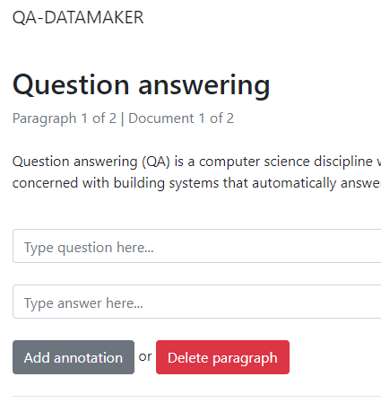
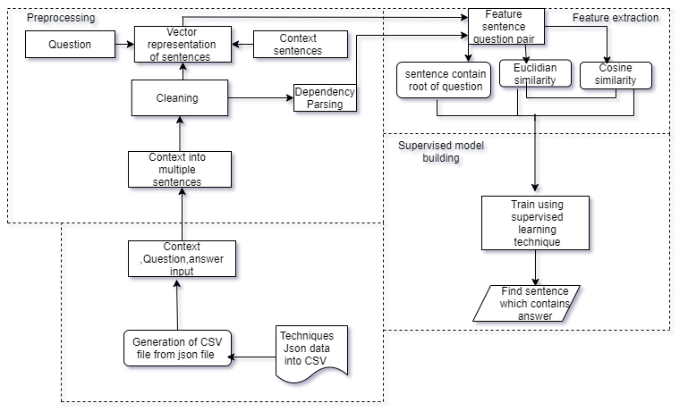
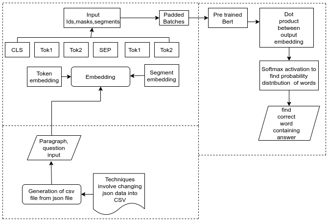

<%
	meta("../../meta.json")
	meta()
	const path = require('path');
	url = url + "/posts/" + path.basename(path.dirname(outputPath)) + "/";
	const _allPosts = metas("../../posts").filter(p => p.meta.published);
	_allPosts.sort((a, b) => b.meta.date.localeCompare(a.meta.date));
	const _mySlug = path.basename(path.dirname(outputPath));
	const _myIdx = _allPosts.findIndex(p => p.directory === _mySlug);
	const prevPost = _myIdx < _allPosts.length - 1 ? _allPosts[_myIdx + 1] : null;
	const nextPost = _myIdx > 0 ? _allPosts[_myIdx - 1] : null;
%>
<%= render("../../_partials/post-header.html", { title, image, url, description, caption, date, tags, reading_time }) %>

My final year project at the University of Moratuwa (2021) was a group project called "Digital Video Making and Smart Answering System". The idea: take a piece of educational text, turn it into a short video for children, and let them ask questions about it afterwards. There were three of us, and each took one module. Dhushanthini simplified the text for children, with summarisation and lexical simplification. Jeevahasan did sentiment and age-group analysis and built the videos from images. My part was the question answering.

That module had two jobs. First, given a paragraph and a question, find the sentence that contains the answer. Second, find the exact words of the answer inside the paragraph. The code is on GitHub as **[automated-answer-grading](https://github.com/haranloga/automated-answer-grading)**.

## The data

I used about 1,500 question and answer pairs from SQuAD, Stanford's question answering dataset. SQuAD is written for adults, so I also annotated about 500 pairs myself, from children's story and general knowledge books and simple Wikipedia articles about places and people. I used an open-source tool called QA Annotator for this. You paste in a paragraph, then type questions and select their answers:

<figure>

<figcaption>The QA Annotator tool used to build the children's dataset. It exports JSON, which I converted to CSV.</figcaption>
</figure>

Each record has the paragraph, the question, the answer, and the character position where the answer starts. Everything was split 80/20 into training and test data.

## Part 1: finding the sentence

Most sentence-similarity work at the time used neural networks. I wanted to see how far a small set of hand-built features and a classic classifier could get.

Each paragraph is split into sentences with TextBlob, and punctuation is removed. Each sentence and the question are turned into vectors with InferSent, a sentence embedding model from Facebook Research, using a vocabulary built from the training data. Then for every sentence and question pair I made three features:

- **Cosine distance** between the sentence vector and the question vector.
- **Euclidean distance** between the same two vectors. In this setup it ranged from 0 to about 60.
- **Root match.** spaCy parses both the question and the sentence into a dependency tree. If the stemmed root word of the question matches the stemmed root of the sentence, the feature is 1, otherwise 0. For a question like "What did the farmer grow?", a sentence whose main verb is also "grow" is a strong candidate.

The model predicts the index of the answering sentence. Every paragraph was treated as having 10 sentence slots. When a paragraph had fewer than 10 sentences, the empty slots got the worst possible values: a cosine distance of 1 and a Euclidean distance of 60.

<figure>

<figcaption>The sentence selection design from the report: preprocessing, the three features, then a supervised classifier.</figcaption>
</figure>

## Results for part 1

| Model | Features | Precision | Recall | Accuracy |
|---|---|---|---|---|
| Logistic regression | Cosine + Euclidean | 0.567 | 0.583 | 57.2% |
| Logistic regression | + root match | 0.638 | 0.651 | 64.4% |
| Random forest (60 trees, min 8 samples per leaf) | + root match | 0.663 | 0.689 | **67.6%** |
| XGBoost (max depth 3, learning rate 0.2) | + root match | 0.667 | 0.683 | 67.5% |

The root match feature did the most work. It lifted logistic regression from 57.2% to 64.4% on its own, which says a lot about how much the grammar of a question tells you. Random forest and XGBoost were almost tied, and I kept the random forest.

## Part 2: finding the exact answer

Knowing the sentence isn't enough to answer a child's question, so the second component extracts the answer span. SQuAD-style data only records where the answer starts, so I wrote an `add_end_idx` function to work out where each answer ends. The paragraph and question were then tokenised with the Hugging Face tokenizer, and the start and end positions converted from characters to tokens.

<figure>

<figcaption>The answer extraction design from the report. The report's diagram says BERT; the model used was DistilBERT base.</figcaption>
</figure>

For the model I fine-tuned DistilBERT base on this data with PyTorch. The model learns two things for every token: how likely it is to be the start of the answer, and how likely it is to be the end. The training loop ran for two epochs and is the image at the top of this post.

It got **62.5% exact match**: the predicted answer's start and end both had to match the labelled answer exactly. That's a strict measure. An answer that's off by one word counts as wrong.

## Looking back

- **The accuracy numbers are modest.** 67.6% on sentence selection and 62.5% exact match were fine for a final year project, and the report said the models weren't ready for real classroom use. Most of the gap is data. 2,000 examples is small, and only 500 were written for children.
- **I'd measure against a simpler baseline.** The report never shows how often picking the sentence with the smallest cosine distance, with no classifier, gets it right. That number would show what the classifier added.
- **Sentence index is an odd target.** Predicting "sentence 3" means the model learns something about positions as well as meaning. Scoring each sentence on its own and taking the highest would avoid that.
- **This would look very different now.** Today a single LLM call answers these questions far better. The part that still matters is the data work: building a small labelled set for a specific audience, and measuring against it properly.

## Cleaning it up for GitHub

The original project folder was about 14 GB, and almost none of that was code. The InferSent encoder and the GloVe vectors it depends on take up several gigabytes on their own. The fine-tuned model's weights were 254 MB, over GitHub's 100 MB file limit, and there were duplicate copies of SQuAD in several folders. The published repo has the code, the small trained classifiers and the model config files, with instructions for downloading the rest.

## Read the full report

The report covers all three modules. My part is the question answering system in chapters 5 to 7, and Appendix A lists who did what.

<%= render("../../_partials/pdf-viewer.html", { src: "media/report.bin", outputPath, filename: "Digital-Video-Making-and-Smart-Answering-System-Report.pdf", note: "Digital Video Making and Smart Answering System" }) %>

Code and setup instructions are on [GitHub](https://github.com/haranloga/automated-answer-grading).

<%= render("../../_partials/post-footer.html", { url, title, prevPost, nextPost }) %>
