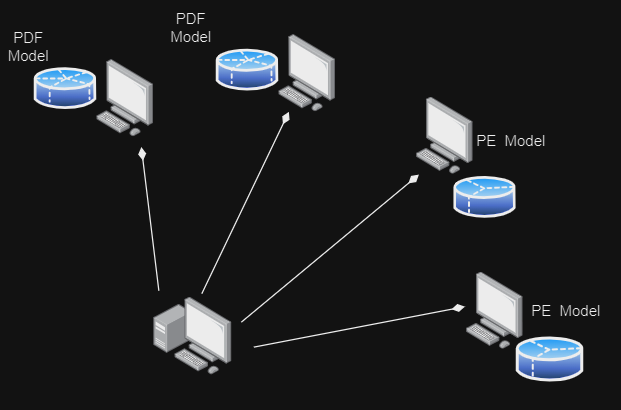
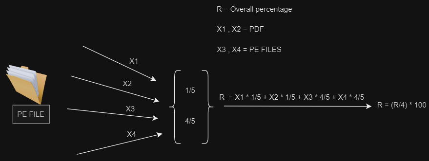

<%
	meta("../../meta.json")
	meta()
	const path = require('path');
	url = url + "/posts/" + path.basename(path.dirname(outputPath)) + "/";
	const _allPosts = metas("../../posts").filter(p => p.meta.published);
	_allPosts.sort((a, b) => b.meta.date.localeCompare(a.meta.date));
	const _mySlug = path.basename(path.dirname(outputPath));
	const _myIdx = _allPosts.findIndex(p => p.directory === _mySlug);
	const prevPost = _myIdx < _allPosts.length - 1 ? _allPosts[_myIdx + 1] : null;
	const nextPost = _myIdx > 0 ? _allPosts[_myIdx - 1] : null;
%>
<%= render("../../_partials/post-header.html", { title, image, url, description, caption, date, tags, reading_time }) %>

My MSc dissertation at the University of West London (2023) asked whether a small blockchain network could handle two jobs for a shared file repository. The first is checking that a file hasn't been changed since it was uploaded. The second is checking that it wasn't malicious to begin with. Integrity is what blockchains are good at. For the malware part, each node in the network runs its own machine learning model, and the nodes vote.

The code is on GitHub as **[malware-detection-blockchain](https://github.com/haranloga/malware-detection-blockchain)**. It's written from scratch in Python: the blocks, proof-of-work, peer-to-peer networking and the Flask API, with no Ethereum or Hyperledger underneath.

The dissertation has three parts: MD5 signature matching, the blockchain itself, and the machine learning models.

## Part 1: MD5 signature matching

The simplest check first. The system calculates the file's MD5 hash, reading the file in 8 KB chunks so large files don't fill memory, and looks it up in a list of hashes of known files, each labelled malware or legitimate. The hash list came from the same Meraz'18 dataset as the ML models below.

I tested it with 15 files, and it identified 7 correctly. The dissertation puts this down to MD5 collisions. Looking at it now, that's wrong. Accidental MD5 collisions are practically impossible. A hash lookup only recognises files that are already on the list, so any file it hasn't seen before is a miss. That limit is the reason for the ML part.

## Part 2: the blockchain

Each block holds an index, a list of transactions, the previous block's hash and a nonce, and its own hash is the SHA-256 of all four. A new chain starts with a genesis block at index 0 with a previous hash of "0". A transaction is a file's metadata: its name, type, signature and size. Proof-of-work means finding a nonce that makes the block's hash start with a set number of zeros. The system uses difficulty 3, three leading zeros, and searches by counting the nonce up from zero.

Every node keeps its own copy of the chain and runs two servers: a socket server for talking to other nodes, and a Flask REST API with endpoints for submitting a new transaction, fetching the chain and adding a block received from another node. A new node connects to the first node on a known port and finds the rest of the network through it. Messages between nodes are JSON with a type field, `DISCOVERY` or `TRANSACTION`, and new transactions and blocks are broadcast to every peer. When a block arrives, the node checks that its hash has the right number of zeros, that it matches the block's contents, and that its previous hash points at the current last block.

To test integrity checking, I uploaded 5 files, changed their contents, and uploaded them again. All 5 were flagged as tampered.

## Part 3: the models

The training data was the Meraz'18 malware dataset from IIT Bhilai: 138,048 Windows executables (PE files), about 70% legitimate and 30% malware, with 57 features taken from the file headers without running anything. They include section and resource entropy, linker versions, code and data sizes, and the entry point address.

<figure>

<figcaption>The test network from the dissertation: two nodes with models for PE files and two with models for PDF files.</figcaption>
</figure>

| Model | Accuracy |
|---|---|
| Random forest (100 trees, max depth 16) | 81.70% |
| Random forest, tuned (randomised search, 5-fold CV on ROC AUC) | 99.50% |
| Decision tree | 99.10% |
| Logistic regression | 70.46% |

The logistic regression number is the one that caught my eye going back through this. 70.46% is almost exactly the share of legitimate files, and its ROC curve in the dissertation is a straight diagonal line with an AUC of 0.50. It learned nothing and labelled every file the same way. The likely cause is unscaled features: PE header values range from single digits to billions. Scaling them first would probably have fixed it.

Each node runs one model, and every node checks each new file. For the second test the network had two nodes with PE models and two with PDF models, using the CIC-PDFMalware2022 dataset for the PDF ones. The system detects the file type, weights each model's vote by how well it matches that type, and flags the file as malware if the weighted score is over 50%.

<figure>

<figcaption>The weighting for a PE file, as drawn in the dissertation.</figcaption>
</figure>

With the first setup, same file type and one model per node, 12 out of 15 test files were classified correctly. With the mixed PE and PDF setup, only 6 out of 15 were. The dissertation blames feature extraction. The formula above shows another cause. It divides by the number of models, 4, when a weighted average should divide by the total weight, which is 2. Even if all four models say malware, the score comes to (1/5 + 1/5 + 4/5 + 4/5) / 4, exactly 50%. The rule needs more than 50%, so as drawn, it can never flag a PE file.

## Choosing a nonce strategy

The repo also has a small experiment, `POW_Comparison.py`, that compares two ways of searching for a nonce: trying random values, or counting up from zero. I re-ran it for this post, averaging 7 runs per difficulty since single runs are noisy:

<svg viewBox="0 0 640 330" role="img" aria-label="Bar chart comparing random versus iterative nonce search time by proof-of-work difficulty, averaged over 7 trials. Difficulty 2: random 1.3 milliseconds, iterative 0.76 milliseconds. Difficulty 3: random 12.4 milliseconds, iterative 11.3 milliseconds. Difficulty 4: random 94.4 milliseconds, iterative 66.5 milliseconds. Difficulty 5: random 3.83 seconds, iterative 2.57 seconds. Iterative nonce search was faster at every difficulty tested." xmlns="http://www.w3.org/2000/svg" style="width:100%;height:auto;display:block;min-width:420px;font-family:var(--font-sans);">
<rect x="150" y="4" width="12" height="12" fill="var(--fg-subtle)"></rect>
<text x="168" y="14" font-size="12" fill="var(--fg-muted)">Random nonce</text>
<rect x="300" y="4" width="12" height="12" fill="var(--accent)"></rect>
<text x="318" y="14" font-size="12" fill="var(--fg-muted)">Iterative nonce</text>
<text x="20" y="60" font-size="13.5" font-weight="600" fill="var(--fg)">Difficulty 2</text>
<rect x="150" y="46" width="470" height="14" rx="3" fill="var(--fg-subtle)"></rect>
<text x="480" y="57" font-size="11.5" fill="var(--fg-muted)">1.30 ms</text>
<rect x="150" y="64" width="275" height="14" rx="3" fill="var(--accent)"></rect>
<text x="285" y="75" font-size="11.5" fill="var(--fg-muted)">0.76 ms</text>
<text x="20" y="130" font-size="13.5" font-weight="600" fill="var(--fg)">Difficulty 3</text>
<rect x="150" y="116" width="470" height="14" rx="3" fill="var(--fg-subtle)"></rect>
<text x="480" y="127" font-size="11.5" fill="var(--fg-muted)">12.4 ms</text>
<rect x="150" y="134" width="431" height="14" rx="3" fill="var(--accent)"></rect>
<text x="441" y="145" font-size="11.5" fill="var(--fg-muted)">11.3 ms</text>
<text x="20" y="200" font-size="13.5" font-weight="600" fill="var(--fg)">Difficulty 4</text>
<rect x="150" y="186" width="470" height="14" rx="3" fill="var(--fg-subtle)"></rect>
<text x="480" y="197" font-size="11.5" fill="var(--fg-muted)">94.4 ms</text>
<rect x="150" y="204" width="332" height="14" rx="3" fill="var(--accent)"></rect>
<text x="342" y="215" font-size="11.5" fill="var(--fg-muted)">66.5 ms</text>
<text x="20" y="270" font-size="13.5" font-weight="600" fill="var(--fg)">Difficulty 5</text>
<rect x="150" y="256" width="470" height="14" rx="3" fill="var(--fg-subtle)"></rect>
<text x="480" y="267" font-size="11.5" fill="var(--fg-muted)">3.83 s</text>
<rect x="150" y="274" width="315" height="14" rx="3" fill="var(--accent)"></rect>
<text x="325" y="285" font-size="11.5" fill="var(--fg-muted)">2.57 s</text>
<text x="20" y="316" font-size="12" fill="var(--fg-subtle)">Average of 7 trials per difficulty, single machine · bars scaled within each difficulty row</text>
</svg>

<strong>Figure 3.</strong> Nonce-search strategy comparison, averaged over 7 trials per difficulty on the reference machine.

Counting up was faster at every difficulty, and at difficulty 5 it took about a third less time. That matches the theory: random guesses can repeat values already tried, while counting up never does. It's also what the main system uses.

## Looking back

- **The headline numbers need context.** 99.5% on a held-out split of the same dataset is a very different claim from 99.5% on malware collected somewhere else, or written after the dataset was made. The end-to-end tests used 15 files each, which is enough for a demo but too few for a percentage to mean much.
- **The arithmetic has slips.** The dissertation reports 7 out of 15 as 53.33% and 6 out of 15 as 60%. They're 46.7% and 40%.
- **The saved model is fragile.** The model file in the repo, `app/model/model.pkl`, is a decision tree pickled with scikit-learn 1.1.2. Loading it with a current version fails with a `ValueError`, because scikit-learn pickles don't carry across versions. Today I'd pin the training environment or export the model to a stable format like ONNX.
- **The next steps are still right.** The dissertation's own list: replace MD5 with SHA-256, add dynamic analysis (running files in a sandbox) alongside the static features, and test how the network holds up with a large number of files.

This was built to demonstrate an idea on a laptop, not to run in production. The difficulty, block size and network size are all set for a demo.

## Read the full dissertation

<%= render("../../_partials/pdf-viewer.html", { src: "media/dissertation.bin", outputPath, filename: "Blockchain-ML-Malware-Detection-Dissertation.pdf", note: "Blockchain and ML based Malware Detection and Integrity Checking of Files: A Decentralized Approach" }) %>

The code is on [GitHub](https://github.com/haranloga/malware-detection-blockchain).

<%= render("../../_partials/post-footer.html", { url, title, prevPost, nextPost }) %>
