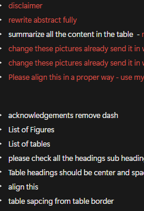

<%
	meta("../../meta.json")
	meta()
	const path = require('path');
	url = url + "/posts/" + path.basename(path.dirname(outputPath)) + "/";
%>
<%= render("../../_partials/post-header.html", { title, image, url, description, caption, date }) %>

# The Complete Markdown Guide

A reference post showing every supported format in the Blog Writer.

---

## Text Formatting

This is a normal paragraph with **bold text**, *italic text*, and `inline code` all mixed together. You can combine them too: **`bold code`**.

> This is a blockquote. Use it for callouts, quotes, or important notes.
> Great for highlighting key points.

---

## Headings

# H1 — Page Title
## H2 — Section
### H3 — Subsection
#### H4 — Detail

---

## Lists

### Bullet List
- First item
- Second item with **bold**
- Third item with `code`
- Nested ideas work too

### Numbered List
1. Step one
2. Step two
3. Step three

---

## Tables

| Feature | Status | Notes |
|---------|--------|-------|
| Markdown editor | ✅ Done | Full toolbar |
| Image paste | ✅ Done | Clipboard support |
| Live preview | ✅ Done | Toggle anytime |
| Table rendering | ✅ Done | With inline formatting |
| Export | ✅ Done | Downloads as `.md` |

### Table with longer content

| Risk | Description | Example |
|------|-------------|---------|
| **Prompt Injection** | Malicious inputs manipulate behavior | Hidden instructions in user input |
| **Data Leakage** | Exposure of sensitive data | Agent revealing private info |
| **Unauthorized Access** | Weak authentication controls | Account takeover |

---

## Code Blocks

### Bash
```bash
# Install dependencies
npm install
npm run dev
```
## size only render 
<figure style="width:28%;margin:1.5rem 0;">

</figure>
<figure style="width:52%;margin:1.5rem 0;">

</figure>
<figure style="width:78%;margin:1.5rem 0;">

</figure>
<figure style="width:100%;margin:1.5rem 0;">

</figure>

## Size + alignment:

<figure style="width:28%;margin:1.5rem auto;display:block;text-align:center;">

</figure>
<figure style="width:52%;margin:1.5rem auto;display:block;text-align:center;">

</figure>
<figure style="float:right;width:28%;margin:0 0 1.5rem 1.5rem;clear:right;">

</figure>
<figure style="float:right;width:52%;margin:0 0 1.5rem 1.5rem;clear:right;">

</figure>

## size + alignment + caption

<figure style="width:28%;margin:1.5rem auto;display:block;text-align:center;">

<figcaption>Figure 1: Overview</figcaption>
</figure>
<figure style="float:right;width:52%;margin:0 0 1.5rem 1.5rem;clear:right;">

<figcaption>Source: 2024</figcaption>
</figure>


And this text continues after the image, wrapping naturally below it.

